# FluentCart Checkout Flow


This document outlines the checkout flow and general architectural insights for the FluentCart plugin.

## Architectural Principles

1. **Single Source of Truth:** FluentCart maintains all checkout data from one consistent source, ensuring data integrity and minimizing discrepancies.
2. **Standardized Extension Interface:** FluentCart offers a clear interface for integrating extensions (like payment methods), keeping extension logic separate from core checkout logic. This ensures stable communication with the server for order processing.
3. **Checkout Flow Tracking:** The system tracks the checkout flow status, allowing users to monitor their progress easily.
4. **Event-Driven Interaction:** Extensions can subscribe to events in the checkout flow, enabling them to respond dynamically to changes and improve user experience.

Here is the high-level overview of the checkout flow:

## Order Flow Steps:

1. **Validating Checkout Form Data**
2. **Validating Products**
3. **Prepare Customer Data**
4. **Prepare and Process order for payment**

The process begins with Validating Order Data, where we assess the information provided to confirm the order and redirect to payment. This foundational step helps prevent errors down the line. Next, we move to Preparing Customer Data, ensuring that all necessary details about the customer are accurately captured and securely stored, essential for personalized service and smooth communication.
Following this, we conduct Validating Products, where we confirm product availability and stocks to ensure that the customer receives exactly what they ordered. Finally, we reach the step of Preparing and Processing Orders for Payment, where we securely handle transactions, ensuring that customers can complete their purchases with confidence.


  
<a href="./images/fluentcart-order-flow-wide-connected.svg" target="_blank">
  View Full Screen
</a>

## 1. Validating Checkout Form Data

After submitting the checkout form, FluentCart's first action is data validation. Initially, we focus on verifying the order's billing address and email. If shipping is required, we also validate the shipping information.

During this validation step, we ensure the data is sanitized and prepared for the subsequent stages. Additionally, we check whether the selected **payment method** is available and functioning correctly, addressing any necessary validation errors that may arise.


<p style="max-width: 400px; margin: 0 auto;">  
    

</p>  

#### Checking Codebase:

```php
namespace FluentCart\Api\Checkout;

class CheckoutApi
{
    public static function placeOrder(array $data)
    {
        static::validateData($data);
        ...
        PaymentHelper::validateMethod($paymentMethod);
        ...
    }
}
```
**validateMethod :** we validate the payment method using 
**PaymentHelper::validateMethod($paymentMethod)** which by default returns false.
From BasePaymentMethod the validateMethod filter hook is triggered with the payment method slug like this fluent_cart/payment/validate_payment_method_stripe.

PaymentHelper::validateMethod($paymentMethod);
```php
   public static function validateMethod($paymentMethod)
    {
        $status = apply_filters('fluent_cart/payment/validate_payment_method_' . $paymentMethod, [
            'isValid' => false,
            'reason' => 'No payment method found!'
        ]);
     ...
```

**validatePaymentMethod:** is validate finally from the child payment method like Stripe, PayPal, etc.
FluentCart\App\Modules\PaymentMethods\BasePaymentMethod

```php
add_filter('fluent_cart/payment/validate_payment_method_' . $this->slug, [$this, 'validatePaymentMethod'], 10, 1);

    public function validatePaymentMethod()
    {
        if (!$this->isEnabled()) {
        ...
```
The validation step ends with those two validations. Exception returns as wp_send_json_error() like this.

```php
 wp_send_json_error(
    [
      'status'  => 'failed',
      'message' => Arr::get($status, 'reason'),
      'data'    => []
    ], 423
 );
```

## 2. Validate Products

In this step, we ensure the checkout items are valid and available in stock. For Subscription products we have to check a couple of things as well. Subscription products are limited to a single quantity, which validates in the stock validation section. In exceptional cases, throws error, otherwise order items will be prepared.

For subscriptions signup, we have to extract the on-time items before applying the discount. Then prepare the data for the discounted item, which will be applicable for the first time payments.


<p style="max-width: 500px; margin: 0 auto;">  
    
</p>  


Summary for this step:

- Quantity validation
- Stock availability
- Preparing one-time items
- Preparing subscription items
- Processing applicable discounts
- Preparing `order_items` for the next step

#### Checking Codebase:
We introduce FluentCart\Api\Checkout\CartCheckoutHelper which is used to retrieve Cart Checkout Items.

```php
$cartCheckoutHelper->getItems()
```

Items should be validated through some certain criteria like stock, availability, max purchase quantity, etc. Check FluentCart\App\Services\OrderService::validateProducts for the validation steps.

```php
class CheckoutApi
{   
   public static function placeOrder(array $data)
   {
     ...
     $cartCheckoutHelper = new CartCheckoutHelper();
     OrderService::validateProducts($cartCheckoutHelper->getItems());
     ...
   }
}
```

## 3. Prepare Customer Data

In this step, the system determines whether the user is a new or existing customer. If necessary, it creates a WordPress user account and updates customer information in the FluentCart database.

<p style="max-width: 500px; margin: 0 auto;">  
    
</p>  


Summary for this step:

- Identify new customer or existing
- Create WordPress user if needed
- Create FluentCart Customer with user_id
- Update Customer billing and shipping

#### Checking Codebase:

After validation is done, we retrieve the customer data using the getOrCreateCustomer method FluentCart\Api\Checkout\CheckoutApi::getOrCreateCustomer()

```php
class CheckoutApi
{   
   public static function placeOrder(array $data)
   {
     ...
     $customer = static::getOrCreateCustomer($cartCheckoutHelper, $orderData);
   }
}
```

getOrCreateCustomer: This method is used to get the customer from $cartCheckoutHelper->getCustomer($email) using customer email. It returns null for unregistered users. If no customer is available, then a new customer will be created by the createCustomerWithAddress() method.

```php
    private static function getOrCreateCustomer(CartCheckoutHelper $cartCheckoutHelper, $orderData)
    {
        $customer = $cartCheckoutHelper->getCustomer(
           static::getCustomerEmail($orderData['billing_address'])
        );

        return static::createCustomerWithAddress(
            $customer,
            $orderData,
            $orderData['billing_address'],
            $orderData['shipping_address']
        );
    }
```

createCustomerWithAddress: which validates the customer to take action, whether the customer will be created or update the billing and shipping for an existing one. And returns the updated customer.

```php
 public static function createCustomerWithAddress(
    $customer, $orderData, $billingAddress, $shippingAddress)
 {
    if (empty($customer)) {
        //create customer
    } else if ($customer instanceof Customer) {
        //update existing customer
    }
    return $customer;
  }
```

## 4. Process and Place Order
This is the final step in our order flow before processing payment. In this stage, we focus on creating the main order, which includes compiling the order items and generating draft transactions. If the customer has selected a subscription product, we also prepare and set up the necessary subscriptions.

Another crucial part of this process is updating the shipping and billing addresses to ensure everything is accurate. After that, we apply any coupons the customer has used. Once everything is in place, we trigger all the events related to order creation and update our stock levels after the order is successfully placed. This step ensures a smooth transition to payment and sets the stage for excellent service.


<p style="max-width: 400px; margin: 0 auto;">  
    
</p>  

Summary for this step:

- Process the order data
- Create transactions for order items
- Create subscriptions
- Update the order with applied coupons
- Dispatch all events
- Update stocks

#### Checking Codebase:
**prepareOrderHelper:** Order processing and creation happen in this step. Constructing the OrderHelper object based on the provided customer details and cart items is the initial step.

```php
class CheckoutApi
{   
   public static function placeOrder(array $data)
   {
     ....
     ....
     ....
     $orderHelper = static::prepareOrderHelper($customer, $cartCheckoutHelper->getItems());

     $orderHelper = static::createOrderWithDraftPayments($orderHelper, $orderData, $cartCheckoutHelper->getUtmData());

     if ($orderHelper instanceof OrderHelper) {
         static::finalizeOrder($orderHelper, $orderData, $cartCheckoutHelper);
     } else {
         static::handleOrderError($orderHelper);
      }
  }
```

#### Explaining OrderHelper instance:
The OrderHelper class simplifies the order processing workflow for both order submissions and payment providers.

##### Required Properties 

Before initializing the payment module, the following properties must be set:

- $items – One-time purchase items from the cart.
- $subscriptionItems – Subscription-based items extracted from the cart, excluding sign-up fees (which are treated as one-time purchases).
- $customer – An instance of FluentCart\App\Models\Customer, representing the checkout user.
- $order – An instance of FluentCart\App\Models\Order, representing the checkout order.
- $transactions – A draft transaction instance of FluentCart\App\Models\OrderTransaction, required for payment processing.

##### Other Properties 

- $activeSubscription – Used for plan upgrades, representing the current subscription via an instance of FluentCart\App\Models\Subscription.
- $paymentFrom – Used to identify the checkout is triggered from which source, like the checkout page, custom checkout page, etc.
- $payableAmount – The total amount to pay, (the amount total – the paid amount).

```php
class OrderHelper
{
    public array $items = [];
    public array $subscriptionItems = [];
    public $customer = null;
    public Order $order;
    public $transaction = null;
    public $activeSubscription = null;
    public $transactions;
    public string $paymentFrom = 'cart';
    public int $payableAmount = 0;
    ......
```

**prepareOrderHelper:** This method is designed to simplify order initialization by encapsulating order preparation logic.
It ensures that both one-time and subscription-based items are properly categorized and processed.
The returned OrderHelper instance can then be used for further actions like payment processing, order submission, etc.

```php
    public static function prepareOrderHelper(Customer $customer, $items): OrderHelper
    {
        $orderHelper = new OrderHelper();
        $orderHelper->setCustomer(
            $customer
        );
        $checkoutItems = new CheckoutService($items);
        $onetimeItems = $checkoutItems->onetime;

        if (!empty($checkoutItems->subscriptions)) {
            ....
            // Create subscription items and process signup fee as onetime
            // Generate subscription plan 
        }
        $orderHelper->addItems($onetimeItems);
        return $orderHelper;
    }
```

##### Use OrderHelper instance to process order:

**createOrderWithDraftPayments:** This method creates an order with draft payments using an OrderHelper instance. It processes the order, processes subscriptions data if applicable, and creates draft payment transactions before committing the order events. Here’s how subscriptions are processed and inserted as drafts.

```php
public static function createOrderWithDraftPayments(OrderHelper $orderHelper, $orderData, $utmData = [])
{
   ......
   ......
    try {
        $orderHelper = $orderHelper->processOrder($data, $utmData);

        if (!empty($orderHelper->subscriptionItems)) {
            foreach ($orderHelper->subscriptionItems as $item) {
                $subscriptionData = static::processSubscriptionData($orderHelper->order,$item);
                $orderHelper->createAndSetDraftTransaction($subscriptionData);
            }
        } else {
        $orderHelper->createAndSetDraftTransaction([
        'payment_method' => $data['payment_method'],
        'status'         => 'pending'
        ]);
        
        $orderHelper->commitEvents();
    }
....
```

**processOrder:** is to process the order data and the orderItems data to store in the DB, and link the customer to that order. Then updates the order status (e.g., pending, completed) with associates’ UTM data for analytics tracking. also return the orderHelper instance with the updated $order ( FluentCart\App\Models\Order) Model.

**processSubscriptionData:** After the Order is set to the OrderHelper instance, Processing Subscriptions: If there are subscription items in the order, it processes each item to derive subscription data and creates a draft transaction for each.

If there are no subscription items, it creates a single draft transaction using general payment information provided in the $data array, marking it as pending.

**commitEvents:** this method is responsible for committing payment events associated with an order context. It performs the following actions:
**Validations:** It checks if the necessary properties (order, customer, and transaction) are set. If any are missing, it throws an exception with a relevant error message.
**Action Triggers:** If the transaction status is considered successful, it triggers specific actions based on the order status and transaction type, allowing external hooks to respond appropriately to payment events.
**Event Hooks:**
fluent_cart/payment_{payment_status}
fluent_cart/payment_{transaction_type}_{orderStatus}
**Return:** It returns the current instance of OrderHelper, enabling method chaining.

## Available Event Hooks
```php
do_action('fluent_cart/payment_' . $orderStatus, $order, $customer, $transaction);
do_action('fluent_cart/payment_' . $transaction->type . '_' . $orderStatus, $order, $customer, $transaction);
```
### Data served by those hooks:
- $order - Order model instance
- $customer - Customer model instance
- $transaction - Transaction model instance

**Example hooks:**
fluent_cart/payment_paid,
fluent_cart/payment_partially-paid,
fluent_cart/payment_one_time_paid, etc.

## Available Order status
##### Order Payment statuses:
- paid
- partially-paid
- refunded
- partially-refunded

##### Order Transaction Type:
- one_time,
- subscription,
- refund,
- subscription_cycle

##### Order Status:
- on-hold,
- processing,
- completed,
- canceled

## Available transaction statuses
- completed,
- refunded
- failed

## Available subscription Status
- active
- canceled
- past-due
- expired


