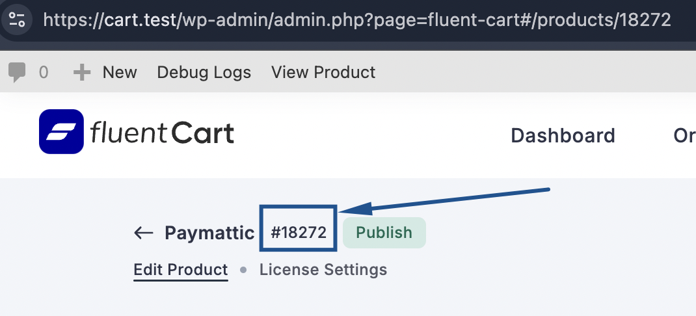
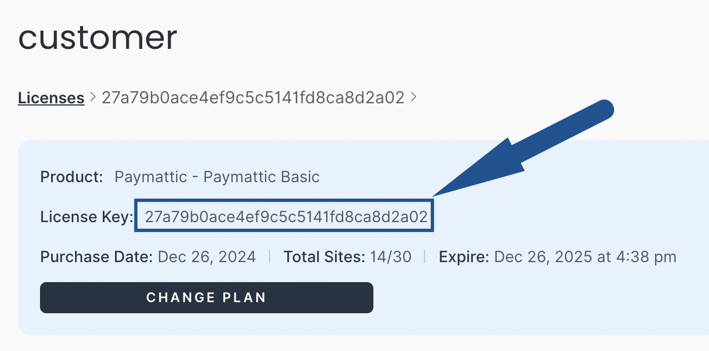

# Fluent Cart Software Licensing API

The API provided with the Fluent Software Licensing extension allows remote license key activation, deactivation, validity verification, update checks, and access to data about the most recent software versions. WordPress plugins and themes are not the only program types that may be integrated using this API. You may use any product using this Fluent Software Licensing


## Available API actions
Four different API request types are available in the fluent software licensing plugin.

- activate_license – To activate the license site remotely
- deactivate_license – To deactivate the license site remotely
- check_license – Validate the license remotely
- get_version – Get the plugin updated version through remote API

To get all those API data we must use the Fluent Cart and Fluent Software Licensing plugins active. All the requests may be achieved using GET/POST requests.

```
https://yourSite.com/?fluent_cart_action={Action Type}&item_id={Product Id}&license={License Key}&url={URL of the site being licensed}
```

**Example request:**
```
https://yourSite.com/?fluent_cart_action=get_version&item_id=18272&license=27a79b0ace4ef9c5c5141fd8ca8d2a03&url=http://www.siteToActive.com
```

## The request params
- fluent_cart_action – The action type listed on the above API actions
- item_id – Item ID I the Product ID of Fluent Cart Product
- license – License key to make the action
- URL – The site URL to make activation or deactivation for

## Activating a License Key
To activate the license remotely the request will be like this:

```
https://yourSite.com/?fluent_cart_action=activate_license&item_id=18272&license=27a79b0ace4ef9c5c5141fd8ca8d2a03&url=http://www.siteToActive.com
```
The fluent_cart_action will be the action name “activate_license“
And item_id needs to be replaced with the fluentCart product ID, See the screenshot below:




The response to this request will be a JSON object. Upon successful activation of the license, the response will be:

```json
{
  "success": true,
  "license": "valid",
  "item_id": "18272",
  "item_name": "",
  "license_limit": "30",
  "site_count": 15,
  "expires": "2025-12-26 04:38:10",
  "activations_left": 15,
  "customer_name": "Madison Whitfield",
  "customer_email": "",
  "price_id": "51",
  "checksum": "aa751d0e7490d0f5120137df96fc6b16"
}
```

If the license is invalid and failed to activate, the response will be:

```json
{
  "success": false,
  "license": "failed",
  "item_id": "18272",
  "item_name": "",
  "license_limit": "30",
  "site_count": "15",
  "expires": "2024-12-09 00:00:00",
  "activations_left": 15,
  "customer_name": "Madison Whitfield",
  "customer_email": "",
  "price_id": "51",
  "error": "expired"
}
```

**Possible errors:**
- "missing_url" - Site URL is not provided
- "missing" - License doesn't provided
- "license_not_activable" - Attempting to activate a bundle's parent license
- "disabled" - License key revoked
- "no_activations_left" - No activations left
- "expired" - License has expired
- "invalid_item_id" - Invalid Item ID
- "site_inactive" - Site is not active for this license
- "invalid" - License key does not match


## Deactivating License #
To deactivate the license remotely the request will be like this:

```
https://yourSite.com/?fluent_cart_action=deactivate_license&item_id=18272&license=27a79b0ace4ef9c5c5141fd8ca8d2a03&url=http://www.siteToActive.com
```
The fluent_cart_action will be the action name “activate_license“
And item_id needs to be replaced with the fluentCart product ID, See the screenshot below:


The response to this request will be a JSON object. Upon successful activation of the license, the response will be:

```json
{
  "success": true,
  "license": "deactivated",
  "item_id": "18272",
  "item_name": "",
  "license_limit": "30",
  "site_count": 14,
  "expires": "2025-12-09 00:00:00",
  "activations_left": 16,
  "customer_name": "Madison Whitfield",
  "customer_email": "",
  "price_id": "51",
  "checksum": "51"
}
```

Possible failed response
```json
{
  "success": false,
  "license": "failed",
  "item_id": "18272",
  "item_name": "",
  "license_limit": "30",
  "site_count": "14",
  "expires": "2025-12-09 00:00:00",
  "activations_left": 16,
  "customer_name": "Madison Whitfield",
  "customer_email": "",
  "price_id": "51",
  "error": "site_inactive"
}
```

## Check License – if the license is valid or active #

Checking if the license is valid or expired. This will return the license validity which is always checked when activating.

To check any license remotely, the URL you will use is:
```
https://yourSite.com/?fluent_cart_action=check_license&item_id=18272&license=27a79b0ace4ef9c5c5141fd8ca8d2a03&url=http://www.siteToActive.com
```

The fluent_cart_action will be the action name “activate_license“
And item_id needs to be replaced with the fluentCart Product ID (see screenshot below)


The license parameter is set to the license key you wish to check.

The response to this request will be a JSON object. Upon successful response of the license, the response will be:
```json
{
  "success": true,
  "license": "valid",
  "item_id": "18272",
  "item_name": "",
  "license_limit": "30",
  "site_count": "15",
  "expires": "2025-12-09 00:00:00",
  "activations_left": 15,
  "customer_name": "Madison Whitfield",
  "customer_email": "",
  "price_id": "51"
}
```

If the license is invalid or expired then the error response will be:

```json
{
  "success": false,
  "license": "failed",
  "item_id": "18272",
  "item_name": "",
  "license_limit": "30",
  "site_count": "15",
  "expires": "2024-12-09 00:00:00",
  "activations_left": 15,
  "customer_name": "Madison Whitfield",
  "customer_email": "",
  "price_id": "51",
  "error": "expired"
}
```

### license statuses should be
- "disabled" - License key revoked
- "expired" - License has been expired
- "disabled" - License key revoked
- "valid" - If license is valid

## Getting version information

To retrieve the version information remotely the action “get_version” is used. To check the update of any WordPress plugin or themes we may use this. It may use the latest version number, including changelogs and download links for the update files.

```
https://yourSite.com/?fluent_cart_action=get_version&item_id=18272&license=27a79b0ace4ef9c5c5141fd8ca8d2a03&url=http://www.siteToActive.com
```

The fluent_cart_action will be the action name “activate_license“
And item_id needs to be replaced with the fluentCart Product ID (see screenshot below)


The license parameter is the license key you wish to check.
The response will be a JSON object that looks something like this:

```json
{
  "new_version": "6.0.0",
  "stable_version": "6.0.0",
  "name": "Paymattic",
  "slug": "paymattic",
  "url": "https://cart.test/items/paymattic/?changelog=1",
  "last_updated": "2024-12-26 04:33:40",
  "homepage": "https://cart.test/items/paymattic/",
  "package": "",
  "download_link": "",
  "sections": "a:2:{s:11:\"description\";s:215:\"\u003Cp\u003EWordPress Payment and Donation\u003Cbr /\u003E\nDeveloped Mastered\u003Cbr /\u003E\nPaymattic is the perfect lightweight WordPress payment and donation plugin fit for your small business, online fundraiser, or membership program.\u003C/p\u003E\n\";s:9:\"changelog\";s:0:\"\";}",
  "banners": "a:2:{s:4:\"high\";s:0:\"\";s:3:\"low\";s:0:\"\";}",
  "icons": {
    "1x": "",
    "2x": ""
  }
}
```

Note about this response:
> [!IMPORTANT]
> If no license key is provided in the get_version on request, the version information is still returned; however, the package and download values will be empty. Conversely, if a license key is provided but does not belong to the item_id in the request, an error response will be returned with a reason.


