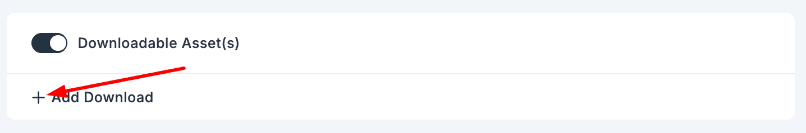
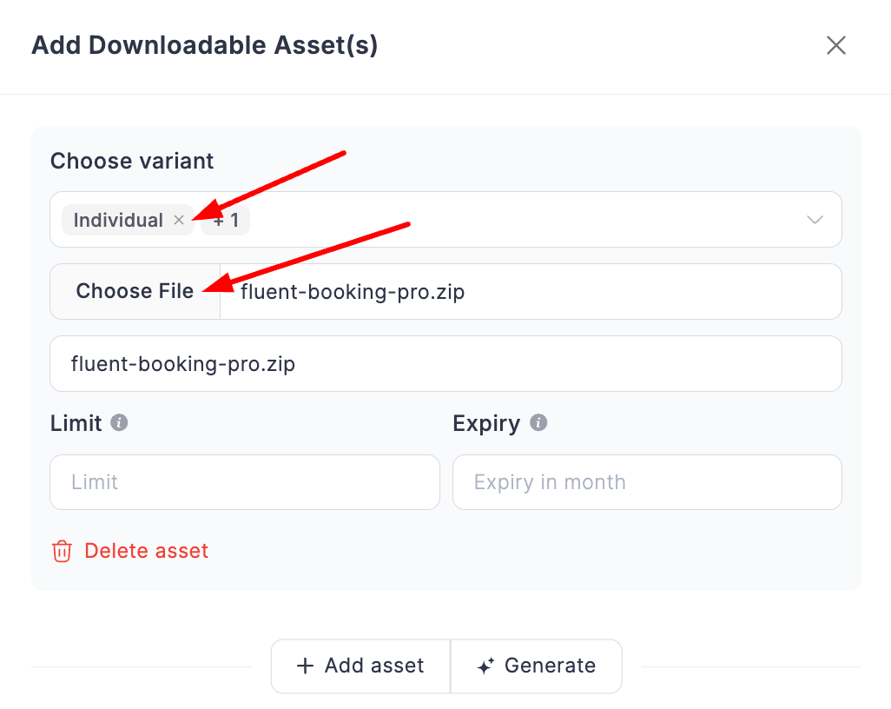
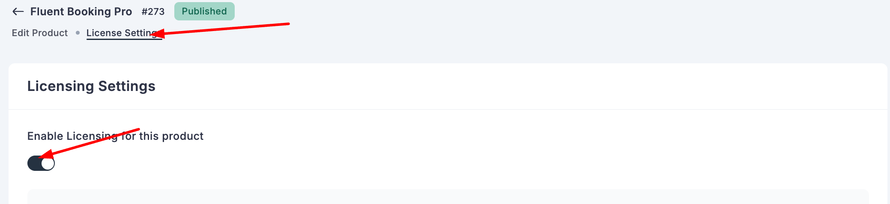
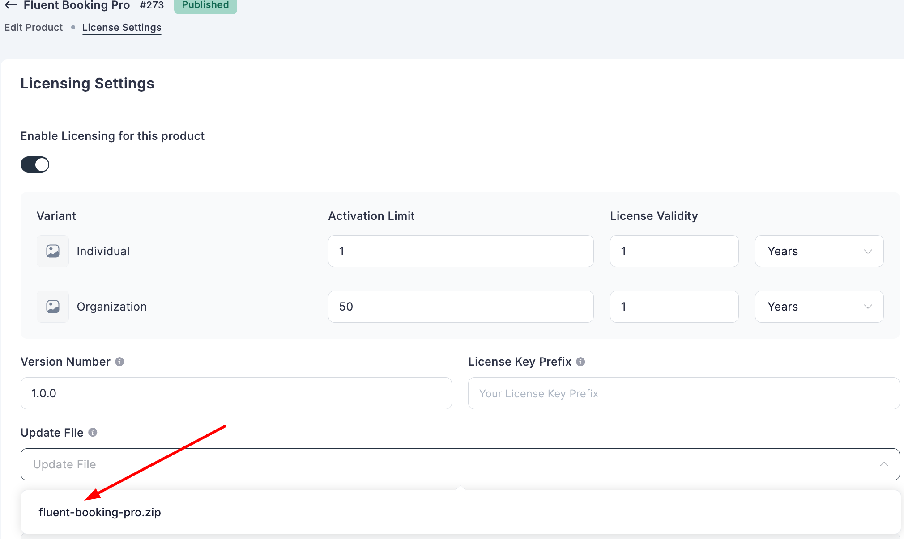
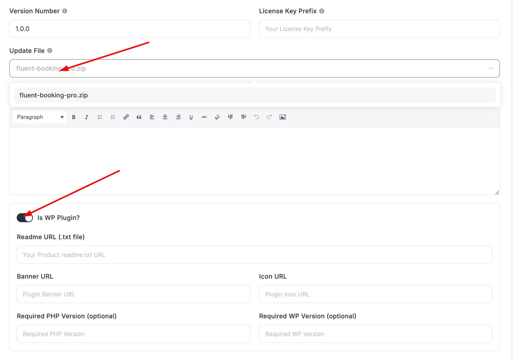
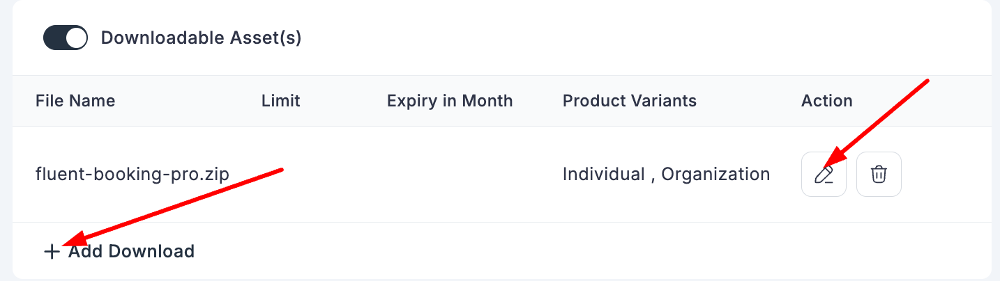
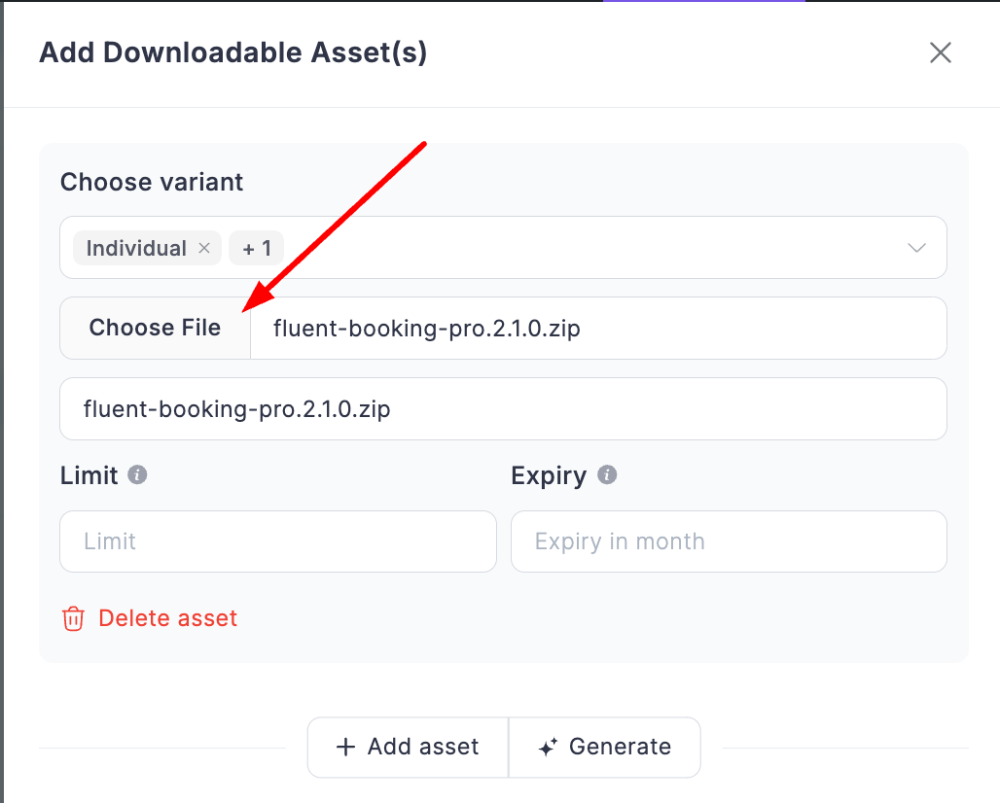
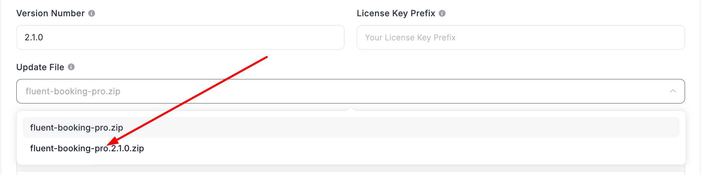
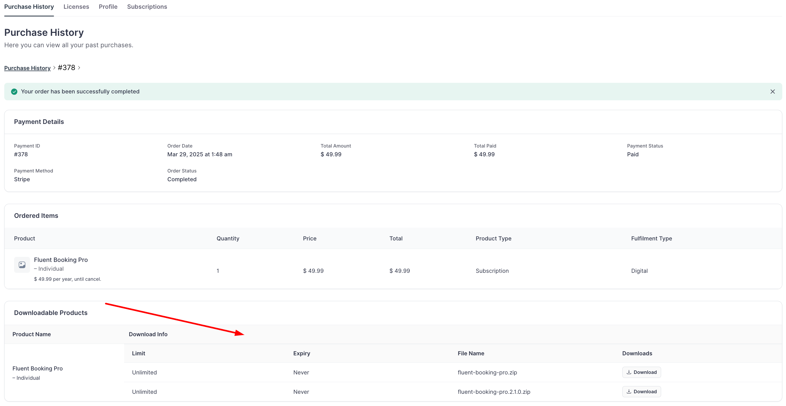

# Product Release and Version Update With Fluent Cart

This guide covers how to release products and manage version updates in Fluent Cart.

## Product Release

### 1. Create the Product
First, create your product in Fluent Cart, configuring pricing and any variations needed.

### 2. Configure Downloadable Assets
1. Enable downloadable assets for the product
2. Add your downloadable files
3. Assign assets to specific variants (or select 'All')
4. Save the assets configuration

### 3. Set Up Update Source File
This file will be used as the source for automatic customer updates.

1. Navigate to License settings
2. Enable licensing
3. Select your update file from the downloadable assets dropdown

### 4. WordPress Plugin Metadata (Optional)
For WordPress plugins, you can configure additional metadata:
- Readme.txt file
- Banner URL
- Icon URL 
- Required PHP version
- Required WordPress version

Ensure your update file is properly configured before saving the settings. Once complete, customers will:
- Have access to downloadable assets in their profile
- Receive automatic updates for future versions

## Version Updates

### 1. Managing Assets
You have two options for updating product files:
- Add new version as separate asset
- Replace existing asset files

### 2. Update Configuration
1. Update the version number
2. If you added a new asset (rather than replacing), update the "Update File" source
3. Verify the update file aligns with latest product version
4. Save changes

After updating, customers will:
- See update notifications where applicable
- Find new downloads in their profile

For detailed information about theme/plugin updater implementation, see the [WordPress themes/plugins setup guide](./wp-themes-plugins-setup.md).
