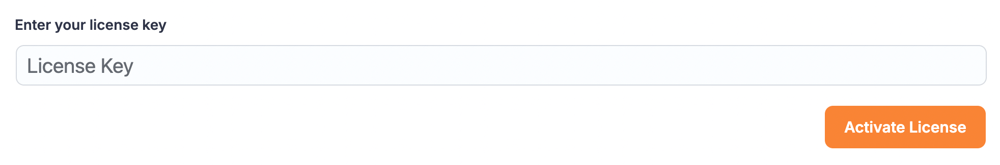
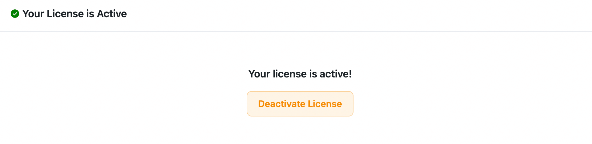

# WordPress themes/plugins setup
Updater Implementation for WordPress Plugins
To maintain the software licensing for the WordPress plugin you have to implement updater into your plugin. The main updater file will be available with the fluent software licensing plugin.
Here you may download it if needed

<a class="wp-block-button__link wp-element-button" href="https://github.com/WPManageNinja/wp-plugin-updater-for-fluent-cart/archive/refs/heads/master.zip">Download Updater Files</a>


## Setup Updater
This updater has two different files LicenseManager and Updater. Copy and paste those into your plugin and replace the plugin namespaces.

Need to Change the followings to those files.

## Step 1 – Define the updater constants #
Change the namespace on the LicenseManager.php file :

Change the namespace on the LicenseManager.php file :

```php
<?php

namespace yourPluginNameSpace\PluginManager;

class LicenseManager
{
    private $settings;
...........
```


Now make your plugin-specific setup by changing the constants. On the construct method of LicenseManager.php file.

```php
public function __construct()
    {
        $this->pluginBaseName = 'your-plugin/your-plugin.php';
        $urlBase = admin_url('admin.php?page=your-plugin-slug#/'); // your plugin dashboard

        $this->settings = [
            'item_id'        => 18272, 
            'license_server' => 'https://yourStore.com', 
            'plugin_file'    => yourPlugin_FILE,      
            'version'        => yourPlugin_VERSION,
            'store_url'      => 'https://yourStore.com', 
            'purchase_url'   => 'https://yourStore.com',
            'settings_key'   => '__yourpluginslug_plugin_license',
            'activate_url'   => $urlBase . 'settings/license',
            'plugin_title'   => 'YourPlugin Pro',
            'author'         => 'yourPluginAuthor name',
        ];
    }
```

item_id: The product ID of Fluent Cart.


**license_server:** License Server will be the main site URL where the Fluent Software License is installed.

**plugin_file:** The plugin file will be the file path of your plugin.

```php
define('yourPlugin_FILE', __FILE__);
```

**store_url:** You may use your store product sales page for this.

**settings_key:** Use the settings key to save your plugin activation details.

## Step 2 – Create a settings page

For a plugin to receive updates, the license key needs to be activated. To activate a license key, the customer will need to enter the key in a field within your plugin settings; then that key needs to be sent to the Software Licensing API on your store’s site.

Create a page on your plugin from where you can get the activation action like this.




## Step 3 – Activate the license

The license manager already has the implementation for activating the site. Use the methods below to activate plugins from customer sites. PluginManager.php: activateLicense method which accepts the $licenseKey only

```php
 public function activateLicense($licenseKey)
    {
        // data to send in our API request
        $api_params = array(
            'fluent_cart_action' => 'activate_license',
           ............
```

## Step 4 – Deactivate the license

The license manager already has the implementation for deactivating the site. Use the methods below to deactivate plugins from customer sites.
PluginManager.php: deactivateLicense method will deactivate the saved license from the customer site. No params need to pass.

```php
 public function deactivateLicense()
    {
        $licenseDetails = $this->getLicenseDetails();

        if (empty($licenseDetails['license_key'])) {
            return new \WP_Error(423, 'No license key found');
        }
        ..............
```




## Step 5 –Verify the license

To get the actual status of the activated license, you may need to verify after a certain time or when the license page visits. Updater has already implemented methods to do that easily. Just call the method below to verify the active license:

```php
public function verifyRemoteLicense($isForced = false)
{
    ............
```

There is a cache value default of 48 hours to check the license status. If you want to make it forcefully bypass the cache please use the $isForced value as true.


> [!INFO]
> More useful methods from LicenseManager.php:
You may check the LicenseManager.php file to get the more useful methods
**getlicenseDetails()**