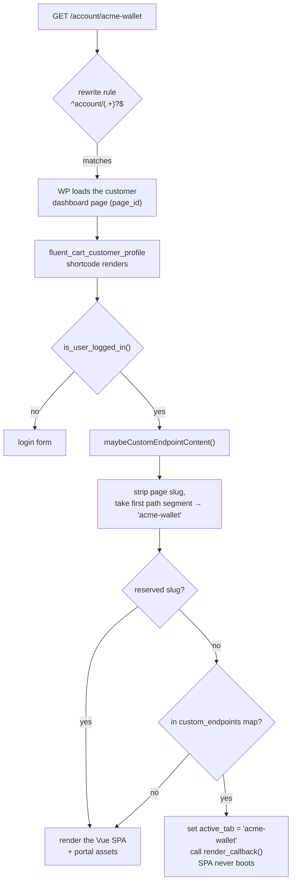

The FluentCart customer portal is a Vue 3 single-page app. Dashboard, purchase
history, subscriptions, licenses, downloads, profile — all client-side routes in
one bundle, shipped by core.

That is a fine architecture right up until an add-on needs a tab in it. A wallet
plugin wants a **Wallet** page. A helpdesk wants **Support**. A payment add-on
wants **Payment Methods**. None of them can compile Vue components into core's
bundle, and none of them should have to.

So `addCustomerDashboardEndpoint()` exists, and the interesting part is not the
API — it is three lines long — but the routing trick underneath that lets a
server-rendered page live inside a client-rendered app without either one
knowing about the other.

<!-- more -->

## One call

```php
add_action('fluent_cart/init', function () {
    fluent_cart_api()->addCustomerDashboardEndpoint('acme-wallet', [
        'title'           => __('Wallet', 'my-plugin'),
        'icon_svg'        => '<svg xmlns="http://www.w3.org/2000/svg" width="20" height="20" viewBox="0 0 20 20" fill="none"><path d="M3 6h14v10H3z" fill="currentColor"/></svg>',
        'render_callback' => function () {
            echo do_shortcode('[my_wallet_widget]');
        },
    ]);
});
```

That is the whole integration. You now have:

- a **Wallet** item in the portal's left nav, sitting just above *Profile*,
- a working URL at `/account/acme-wallet` (whatever your customer dashboard page
  slug is),
- the portal's header, avatar block, nav, logout button, and responsive
  behaviour wrapped around your content,
- correct active-tab highlighting when a customer is on your page,
- no rewrite rule to register, no permalink flush, no `template_redirect` hook,
  no Vue, no build step.

Two things in that snippet are doing more work than they look like they are.

**`fluent_cart/init` is the hook to use.** It fires from `boot/app.php:40`:

```php
add_action('plugins_loaded', function () use ($app) {
    do_action('fluentcart_loaded', $app);

    add_action('init', function () use ($app) {
        DBMigrator::maybeMigrateDBChanges();
        do_action('fluent_cart/init', $app);   // ← you are here
        // ...
    });
});
```

It runs inside WordPress's `init`, after migrations, and it only fires **if
FluentCart is loaded at all**. That is the whole point: inside that callback,
FluentCart is present, booted, and its globals are defined. You do not need
`function_exists()`, you do not need `class_exists()`, and you do not need to
guess a priority — if FluentCart isn't active, your callback simply never runs
and your plugin does nothing, which is exactly the behaviour you wanted from the
guard anyway. The `$app` container instance is passed as the first argument if
you need it.

Attach your listener at the top level of your plugin file (or anywhere before
`init`) and you're done. Registering later than `init` — inside `wp`,
`template_redirect`, or `wp_enqueue_scripts` — is too late: by then the portal
may already be rendering its menu, and your tab silently isn't there.

**`fluent_cart_api()` is the public entry point.** It's a global function defined
in `boot/globals.php` returning the `FluentCart\Api\FluentCartGeneralApi`
singleton. Prefer it over reaching into the class directly — it is the surface
we treat as public API, and it keeps your code free of `FluentCart\…` class
references that would fatal on a site where the plugin is missing. The
alternative, `\FluentCart\Api\FluentCartGeneralApi::getInstance()`, is the same
object; you'll see it in older integrations written before the helper existed.

## The second form: hand it a WordPress page

`render_callback` is one of two ways to fill the page. The other is `page_id` —
you point the endpoint at an ordinary WordPress page and let core render it:

```php
add_action('fluent_cart/init', function () {
    fluent_cart_api()->addCustomerDashboardEndpoint('help', [
        'title'   => __('Help', 'my-plugin'),
        'page_id' => get_option('my_plugin_help_page_id'),
    ]);
});
```

Core runs a one-post `WP_Query`, renders `the_content()` inside a
`.fluent-cart-custom-page-content` wrapper, and calls `wp_reset_postdata()`. The
page's own template, header, and sidebar are *not* used — only its content —
which is exactly what you want for something that has to sit inside the portal
shell. If the ID doesn't resolve, the customer sees "No content found!".
`render_callback` wins if you pass both.

This is the right form whenever the page is really *content* — a help page, a
terms summary, an onboarding note, a page built in the block editor. A site
owner can edit it without touching your plugin, and you didn't have to write a
renderer.

### Make the Account page its parent

Here's the part that makes `page_id` genuinely pleasant, and it's easy to miss.

Set the endpoint page's **parent** to your Account (customer dashboard) page in
the Page Attributes panel, and give it a **slug matching the endpoint slug**.
WordPress then builds the page's permalink as `/account/help/` — which is
byte-for-byte the URL the portal nav already points at.

You don't have to do this. But when you don't, the page has two addresses: its
real permalink somewhere else on the site, and the portal URL. When you do, there
is exactly one URL, and it is the portal one. Concretely:

- The page's **View** link in wp-admin opens it inside the portal, in the shell,
  with the nav highlighted — not as a bare page on the theme's template.
- Yoast/breadcrumbs/menus/search all point at the portal URL, because it *is* the
  permalink.
- The site owner can find and edit the page in **Pages** like any other page,
  nested under Account in the list view where they'd expect it.

I checked this end-to-end on a live install rather than trusting the reasoning.
Creating a page with `post_parent` set to the Account page and slug `fct-doc-test`
gives `get_page_link()` → `https://cart.lab/account/fct-doc-test/`, and
`URL::getCustomerDashboardUrl('fct-doc-test')` → the same path. Requesting it as a
logged-in customer returns 200 and the response contains the page's content
inside `.fluent-cart-custom-page-content`, wrapped in the portal shell, with
`active_customer_menu` on `.fct-customer-nav-item-fct-doc-test`. The SPA mount
point `data-fluent-cart-customer-profile-app` is absent, exactly as the branch in
`renderCustomerAppContainer()` predicts.

Why does this work at all? Because of the wildcard rewrite rule covered under
*How a URL becomes your callback* below: `^account/(.+)?$` is registered with
`'top'` priority, so it wins before WordPress's own page-hierarchy rules ever get
a look. The request resolves
to the *Account* page, the portal boots, and the path segment `help` is matched
against the endpoint map. Your child page is never resolved as a page by
WordPress — core loads its content deliberately, by ID.

::: warning A child page without a registered endpoint is unreachable
That same rewrite rule is unconditional. Park a page under Account and *don't*
register a matching endpoint, and the page becomes a dead end: the request still
resolves to the Account page, `maybeCustomEndpointContent()` finds nothing, so
core boots the Vue SPA — whose router has no such route. The customer gets the
portal shell with nothing in it, and the page's own content never renders.

Verified: an orphan child page at `/account/fct-orphan/` returned 200 with the
SPA mount point present and its own content nowhere in the response.

So the page and the endpoint registration are a pair. If your plugin creates the
page on activation, register the endpoint unconditionally on `fluent_cart/init` —
not behind a setting that can be switched off while the page stays published.
:::

One cosmetic note while you're here: `URL::getCustomerDashboardUrl()` builds the
nav link *without* a trailing slash, and WordPress canonicalises to the trailing
slash form. So the first click on your tab costs a 301. This is true for every
custom endpoint, `page_id` or callback, and is harmless — just don't be puzzled
by the redirect in your network tab.

## What the call actually does

`addCustomerDashboardEndpoint()` (`api/FluentCartGeneralApi.php:25`) validates
its arguments and then registers **two filters**. That is it. There is no
registry object, no custom post type, no route table.

```php
add_filter('fluent_cart/global_customer_menu_items', /* insert nav item */);
add_filter('fluent_cart/customer_portal/custom_endpoints', /* register slug => callback */);
```

The first filter puts a nav item in the menu. The second one puts your slug in a
map the portal consults at render time. The split matters: the menu is rendered
on *every* portal page, while the endpoint map is only consulted when the
requested path doesn't belong to core.

You can call those two filters directly and skip the API entirely — they're
documented under
[customer & subscription filters](/hooks/filters/customers-and-subscriptions).
The wrapper exists because getting the nav-item array shape, the URL builder, and
the CSS class right by hand is three chances to be subtly wrong, and one of them
is load-bearing in a way that isn't obvious. More on that in a moment.

## How a URL becomes your callback

This is the part worth understanding, because it explains every constraint that
follows.



Three details in that flow do all the work.

**The rewrite rule is a wildcard, registered once.** On `init`,
`CustomerProfileHandler::register()` adds a single rule
(`CustomerProfileHandler.php:43-55`):

```php
add_rewrite_rule(
    '^' . $pageSlug . '/(.+)?$',
    'index.php?page_id=' . $customerProfilePageId,
    'top'
);
```

Everything under the dashboard slug resolves to the same WordPress page. That is
why your endpoint needs no rewrite rule of its own and why you never have to
flush permalinks — a new slug is not new routing, it is new *content* on routing
that already exists. It also means "does this path exist?" is a question core
answers in PHP at render time, not something the rewrite layer knows about.

The `'top'` argument is what makes the parent-page trick work: this rule is
inserted ahead of WordPress's own rules, including page hierarchy. A real child
page sitting at `/account/help/` never gets resolved as a page — the wildcard
claims the URL first, and core loads that page's content by ID instead. The same
priority is why an unregistered child page is unreachable: there is no fallback
path back to normal page resolution.

`getCustomerDashboardPageSlug()` derives that prefix from `get_page_link()` minus
the home URL, so it is the page's **full path**, not just its post slug. Nest the
Account page itself under `/my/` and the rule becomes `^my/account/(.+)?$`. It
handles that correctly; just don't assume the prefix is a single segment when
you're parsing `$wp->request` yourself.

**Only the first path segment is matched.** `maybeCustomEndpointContent()`
(`CustomerProfileHandler.php:154`) strips the dashboard page slug, splits what's
left on `/`, and `array_shift()`s the first segment. `/account/acme-wallet` and
`/account/acme-wallet/transactions/42` both resolve to the endpoint
`acme-wallet`. The remaining segments are **discarded** — they are not passed to
your callback. If you want sub-routes, read them yourself:

```php
'render_callback' => function () {
    global $wp;

    // Slice off everything up to and including your own slug, rather than
    // assuming a fixed offset — the dashboard prefix can be more than one
    // segment if the Account page is nested.
    $segments = explode('/', trim($wp->request, '/'));
    $position = array_search('acme-wallet', $segments, true);
    $subPath  = $position === false ? [] : array_slice($segments, $position + 1);

    if (!empty($subPath) && $subPath[0] === 'transactions') {
        echo my_plugin_render_transactions();
        return;
    }

    echo do_shortcode('[my_wallet_widget]');
}
```

**When your endpoint matches, the SPA does not boot.** Look at the branch in
`renderCustomerAppContainer()` (`CustomerProfileHandler.php:130-145`):

```php
$customEndpointContent = $this->maybeCustomEndpointContent();

if (!$customEndpointContent) {
    (new static())->enqueueStyles();
}

add_action('fluent_cart/customer_app', function () use ($customEndpointContent) {
    if ($customEndpointContent) {
        echo $customEndpointContent;   // your output
    } else {
        AssetLoader::loadCustomerDashboardAssets();
        $this->renderCustomerApp();    // <div data-fluent-cart-customer-profile-app>
    }
});
```

Your page and core's SPA are mutually exclusive. Core's page renders the mount
point and enqueues the bundle; your page renders your HTML and doesn't. That is
a deliberate trade — you inherit the shell, not the runtime — and it is the
source of the asset rules below.

## The link is a full page load, on purpose

Core's own nav items carry the CSS class `fct_route`. On `DOMContentLoaded`,
`Start.js:342` walks every `a.fct_route`, resolves the href against the Vue
router, and if the router matches, calls `preventDefault()` and pushes the route
client-side.

Your nav item is given the class `fct-menu-item-<slug>` instead. It is never
picked up by that listener, so clicking it is an ordinary browser navigation —
full page load, PHP renders, your callback runs.

This is not an oversight. If your link were tagged `fct_route`, one of two things
would happen: the router wouldn't match the path and the click would fall through
to a normal navigation anyway (harmless but accidental), or — worse — a future
core route would start matching your slug and swallow the click into a 404 inside
the SPA. Opting out of the interceptor is what makes a server-rendered page safe
to embed in a client-rendered app.

The practical consequence: **navigating to your page costs a full page load, and
navigating away from it costs another one.** For a page a customer visits
occasionally, that is the correct trade. For something they'd tab in and out of
constantly, it isn't — see *When not to use this* at the end.

## What the API refuses to do

Two guard clauses, both of which `throw`:

```php
$reserved = ['dashboard', 'purchase-history', 'subscriptions', 'licenses', 'downloads', 'profile'];

if (in_array($slug, $reserved)) {
    throw new \Exception(/* ... */);
}

if (!isset($args['render_callback']) && !isset($args['page_id'])) {
    throw new \Exception(/* ... */);
}
```

An empty slug throws too. Because `fluent_cart/init` fires on every request, an
uncaught exception here is a **fatal on every page load of the site**, not a
quiet failure on the portal. If your slug is anything other than a hard-coded
literal — a setting, a filter, a slug derived from a post — wrap the call:

```php
try {
    fluent_cart_api()->addCustomerDashboardEndpoint($slug, $args);
} catch (\Exception $e) {
    // log it, skip the tab, keep the site up
}
```

### The reserved list is shorter than the route list

Here is a sharp edge that is easy to walk into. The reserved list has six
entries. The SPA's router (`Start.js`) has ten routes, including:

| Route | Reserved? |
|---|---|
| `/purchase-history` | yes |
| `/subscriptions` | yes |
| `/downloads`, `/licenses`, `/profile` | yes |
| `/order/:order_id` | **no** |
| `/subscription/:subscription_uuid` | **no** |

`URL::getCustomerOrderUrl()` builds links to `/{dashboard}/order/{uuid}` — a real,
linked-to route in every order confirmation. But `order` is not in the reserved
list, so `addCustomerDashboardEndpoint('order', …)` is accepted without complaint,
and from then on every order-detail link renders *your* page instead. Same for
`subscription` (singular — the plural is reserved, the singular isn't).

Don't rely on the guard to protect you. **Namespace your slug.** `acme-wallet`
beats `wallet`, and it costs you nothing.

## What you own

The shell is core's. Everything inside it is yours, including the parts that are
easy to forget.

### Escaping

Your callback's output is echoed with escaping explicitly suppressed:

```php
echo $customEndpointContent; // @phpcs:ignore WordPress.Security.EscapeOutput.OutputNotEscaped
```

Core cannot escape it — you are returning HTML by design. So every dynamic value
inside your callback goes through `esc_html()`, `esc_attr()`, `esc_url()`, or
`wp_kses()` before it reaches the buffer. There is no second line of defence
behind you.

The `page_id` form is exempt: that content goes through `the_content()` and
WordPress's normal filters, so it is no more and no less trusted than any other
page on the site.

### Authorization

The portal gates on `is_user_logged_in()` and nothing else. Any logged-in user
reaches any registered endpoint. If your page shows data belonging to a customer,
resolve *which* customer from the session rather than from anything in the
request:

```php
'render_callback' => function () {
    $customer = \FluentCart\Api\Resource\CustomerResource::getCurrentCustomer();

    if (!$customer) {
        echo '<p>' . esc_html__('No customer record found.', 'my-plugin') . '</p>';
        return;
    }

    // Query by $customer->id — never by an id from $_GET.
    echo my_plugin_render_wallet($customer->id);
}
```

`getCurrentCustomer()` returns `null` for logged-out users and is memoised per
request, so calling it repeatedly inside your renderer is free.

### Assets

This is the one that surprises people. On a custom-endpoint page:

**Loaded:** `customer-profile-global.scss` — the portal shell, the nav, and the
full set of `--fct-customer-dashboard-*` CSS custom properties.

**Not loaded:** `customer-profile.scss` and `Start.js`. `enqueueStyles()` is
skipped and `AssetLoader::loadCustomerDashboardAssets()` is never called, which
also means the `fluent_cart/customer_dashboard/enqueue_assets` action does not
fire on your page, and `window.fluentcart_customer_profile_vars` does not exist.
Anything you were hoping to borrow from core's bundle — Element Plus, the REST
config, the translation strings — is absent.

Enqueue your own, conditionally:

```php
add_action('wp_enqueue_scripts', function () {
    global $wp;
    if (strpos($wp->request ?? '', '/acme-wallet') === false) {
        return;
    }

    wp_enqueue_style('acme-wallet', plugins_url('assets/wallet.css', __FILE__), [], '1.0.0');
    wp_enqueue_script('acme-wallet', plugins_url('assets/wallet.js', __FILE__), [], '1.0.0', true);
});
```

To look native without importing core's stylesheet, style against the custom
properties the shell already defines:

```css
.acme-wallet-card {
    color: var(--fct-customer-dashboard-text-color);
    border: 1px solid var(--fct-customer-dashboard-border-color);
    border-radius: 8px;
    padding: 16px;
}

.acme-wallet-card h3 {
    color: var(--fct-customer-dashboard-title-color);
}
```

Those variables inherit from the store's theme colors, including the ones a site
owner sets through the shortcode's `colors` attribute. Hard-coded hex values will
drift the moment someone rebrands; these won't.

### Icons

`icon_svg` is rendered through `wp_kses()` against a deliberately tight allowlist
(`fct_allowed_svg_tags`): `svg`, `path`, and `g`, with only geometry and
stroke/fill attributes. No `title`, no `defs`, no `use`, no inline `style`. Give
the SVG `width="20" height="20"` and `fill="currentColor"` so it picks up the
nav's active and hover states, and strip anything decorative before pasting it
in — it will be silently removed otherwise.

If your icon doesn't survive the allowlist, `icon_url` takes an image URL
instead. Only one of the two is used; `icon_svg` wins if both are set.

## Two real integrations

**Fluent Support** adds a Support tab that renders its existing portal shortcode
(`FluentCart.php:241`):

```php
fluent_cart_api()->addCustomerDashboardEndpoint('fluent-support', [
    'title'           => __('Support', 'fluent-support'),
    'render_callback' => function () {
        echo do_shortcode('[fluent_support_portal]');
    },
    'priority'        => 'high'
]);
```

Note `'priority' => 'high'`. `addCustomerDashboardEndpoint()` reads exactly four
keys — `title`, `icon_svg`, `icon_url`, and `render_callback`/`page_id` — so
`priority` is silently ignored. It does nothing, and it has never done anything.
Menu order is not configurable through this API.

**Credex** does the same for a wallet — hooking WordPress's own `init` and
guarding with `class_exists()`:

```php
add_action('init', [$this, 'addCredexMenuInFluentCart']);

public function addCredexMenuInFluentCart()
{
    if (!class_exists('\FluentCart\Api\FluentCartGeneralApi')) {
        return;
    }

    \FluentCart\Api\FluentCartGeneralApi::getInstance()->addCustomerDashboardEndpoint('wallet', [
        'title'           => __('Wallet', 'credex'),
        'render_callback' => function () {
            echo do_shortcode('[credex_user_wallet]');
        },
    ]);
}
```

This works, and it is what you'll find in the wild. Written today it would be
four lines shorter — `fluent_cart/init` makes the guard redundant, and
`fluent_cart_api()` makes the class reference unnecessary:

```php
add_action('fluent_cart/init', [$this, 'addCredexMenuInFluentCart']);

public function addCredexMenuInFluentCart()
{
    fluent_cart_api()->addCustomerDashboardEndpoint('credex-wallet', [
        'title'           => __('Wallet', 'credex'),
        'render_callback' => function () {
            echo do_shortcode('[credex_user_wallet]');
        },
    ]);
}
```

Both integrations wrap an existing shortcode. That is the shape this API is built
for: you already have a rendering path, and you want it to appear inside the
portal chrome rather than on a standalone page.

## Where your tab lands

Each registration inserts its item **immediately before `profile`** in the menu
array. Two add-ons registering on the same hook therefore end up in the order
their filters ran, both above Profile — so relative order between add-ons is
plugin load order, which is alphabetical by directory name and not something you
should build on.

If placement genuinely matters, hook `fluent_cart/global_customer_menu_items` at
a late priority and reorder the array yourself. Bear in mind that `licenses` is
unset unless Pro is active with the license module on, and `subscriptions` is
unset for customers who have none — so write reordering code that tolerates
missing keys.

Active-tab highlighting needs nothing from you. When your endpoint matches,
`maybeCustomEndpointContent()` filters `fluent_cart/customer_portal/active_tab`
to your slug, and the inline script in `customer_app.php` adds
`.active_customer_menu` to `.fct-customer-nav-item-<slug>`.

## Checklist

- [ ] Registered inside `add_action('fluent_cart/init', …)` — no
      `function_exists()` or `class_exists()` guard needed
- [ ] Called through `fluent_cart_api()`, not the class directly
- [ ] Namespaced slug — not `wallet`, `order`, `subscription`, or anything else a
      core route might claim
- [ ] Wrapped in `try/catch` if the slug isn't a literal
- [ ] Using `page_id` if the page is editable content, with the Account page as
      its **parent** and its slug matching the endpoint slug
- [ ] No child page parked under Account without a matching endpoint registered
- [ ] Every dynamic value in the callback escaped
- [ ] Customer resolved from the session, never from the request
- [ ] Assets enqueued conditionally — nothing from core's bundle is available
- [ ] Styled against `--fct-customer-dashboard-*`, not hard-coded colors
- [ ] Icon reduced to `svg`/`path`/`g` with `fill="currentColor"`

## When not to use this

`addCustomerDashboardEndpoint()` gives you a **whole page** reached by a **full
page load**. Two cases where that's the wrong tool:

**You want a section inside an existing portal page** — a block on the profile
page, extra rows under an order. Use
`fluent_cart/customer_portal/profile_sections` and the dynamic per-slug section
filter instead. Those render inside the SPA, so they need no navigation at all
and cost no page load.

**You want a genuinely interactive app** — something with client-side state that
a customer moves in and out of. A full page load on every entry and exit will be
felt. Consider whether the work belongs on your own page template outside the
portal, linked from a portal tab.

For everything else — a wallet, a support inbox, saved payment methods, a
membership summary, a help page — one PHP call is the entire integration:
`render_callback` when you have a renderer, `page_id` when a site owner should
own the content. The routing was already there. All this API does is tell it your
name.

---

*Source references: `api/FluentCartGeneralApi.php`,
`app/Hooks/Handlers/ShortCodes/CustomerProfileHandler.php`,
`app/Modules/Templating/AssetLoader.php`,
`resources/public/customer-profile/Start.js`. Filter documentation:
[customer & subscription filters](/hooks/filters/customers-and-subscriptions).*
