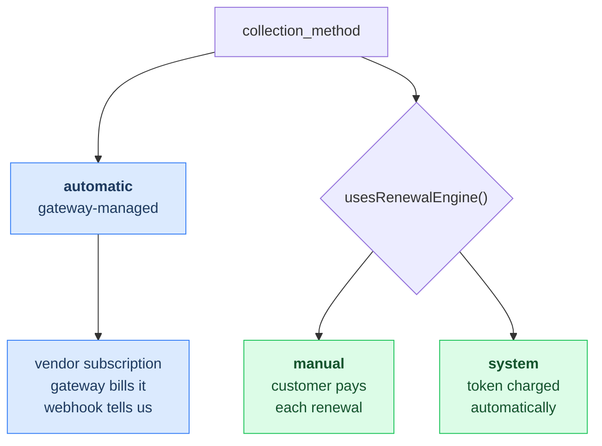
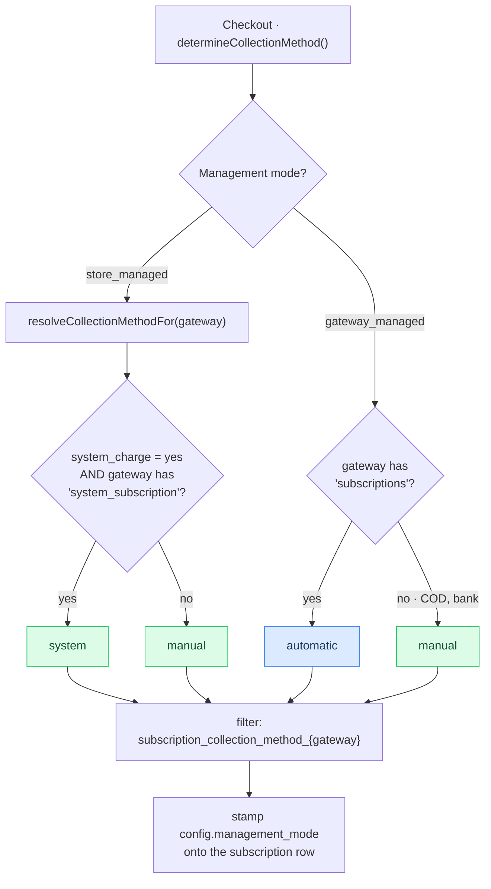
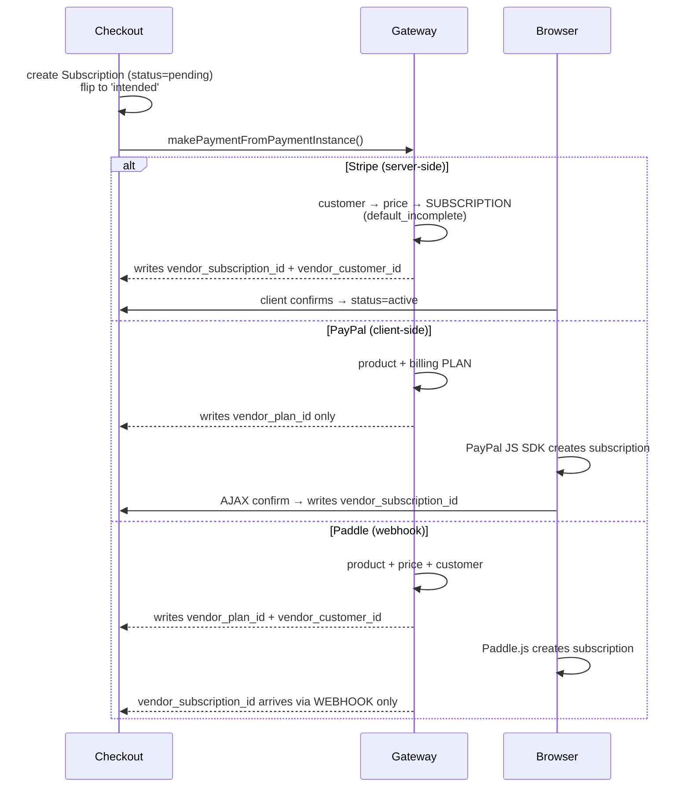
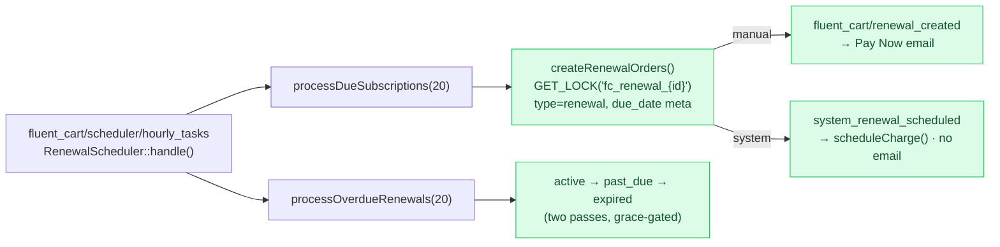
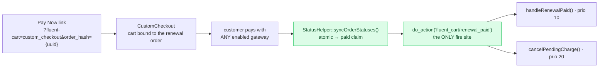
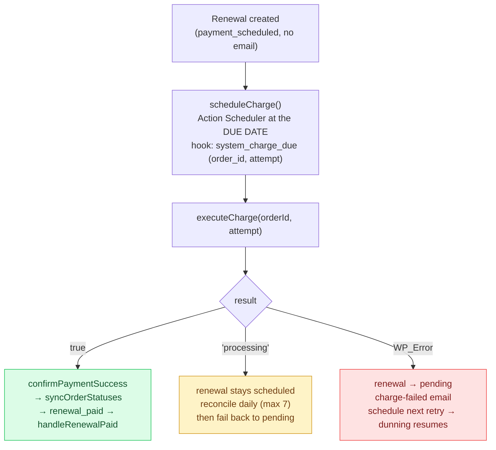
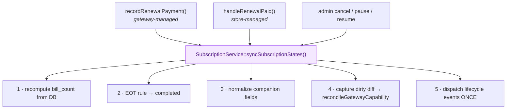

# Subscriptions Module

FluentCart's subscription engine bills recurring products through **two competing models** — one where the payment gateway owns the schedule, and one where FluentCart owns it — unified behind a single database column and a single shared write-spine. This document is the architectural map: how the model is chosen, what machinery each one uses, and where they converge.

::: tip Where subscriptions live
| Concern | Location |
|---|---|
| Model + attributes | [`Subscription` model](/database/models/subscription) · [`SubscriptionMeta`](/database/models/subscription-meta) |
| Lifecycle hooks | [Action hooks](/hooks/actions/subscriptions) · [Filter hooks](/hooks/filters/customers-and-subscriptions) |
| REST endpoints | [Subscriptions API](/api/subscriptions) · [REST operations](/restapi/subscriptions) |
| Core code | `app/Modules/Subscriptions/` · `app/Modules/StoreManagedRenewal/` |
:::

## The one idea

Every subscription answers a single question: **who owns the billing schedule — the payment gateway, or FluentCart?**

That answer is the `fct_subscriptions.collection_method` column, and it decides everything downstream: whether a renewal is a webhook you receive or a renewal you generate, whether dunning is Stripe's retry ladder or FluentCart's grace period, whether an admin can edit the recurring amount.

| `collection_method` | Who bills | Renewal arrives as | Dunning owned by |
|---|---|---|---|
| `automatic` | The **gateway**, via a vendor subscription object (Stripe `sub_…`, PayPal `I-…`) | An inbound **webhook** | The gateway |
| `manual` | **FluentCart**, via the renewal engine; the customer pays each renewal by hand | A **renewal** you generate on a cron | FluentCart (reminders → past_due → expired) |
| `system` | **FluentCart**, via the renewal engine; a saved token is charged automatically | A **renewal** you generate, then charge off-session | FluentCart (retries → past_due → expired) |

`manual` and `system` are the **same engine**. `system` just adds a saved payment method and an automatic charge attempt per renewal. The predicate that groups them is `Subscription::usesRenewalEngine()` — **that method, not `collection_method` itself, is the real store-managed test**, and it appears as a guard throughout the codebase.



**Reading by type:** `automatic` → [Gateway-managed](#gateway-managed-automatic). `manual` → [the renewal engine](#store-managed-the-renewal-engine-manual-system) (it is the base — there is no separate "manual" section). `system` → the renewal engine **plus** [the auto-charge delta](#store-managed-auto-charge-system). [The capability matrix](#what-each-model-allows) compares all three side by side.

## How the method is decided

Exactly one place, exactly once — at checkout. `CheckoutProcessor::determineCollectionMethod()`:



Two inputs: a **store setting** and a **gateway capability**.

### The setting

`SubscriptionManagementMode` (`app/Modules/Subscriptions/Services/SubscriptionManagementMode.php`) reads from the `fluent_cart_store_settings` option blob, rendered on the Subscriptions settings tab and sanitized by whitelist in the meta request.

| Key | Values | Default |
|---|---|---|
| `subscription_management_mode` | `gateway_managed` \| `store_managed` | `gateway_managed` |
| `subscription_system_charge` | `yes` \| `no` | `no` |
| `subscription_manual_fallback` | `yes` \| `no` | `no` |

`subscription_system_charge` is inert under `gateway_managed` — `isSystemChargeEnabled()` returns `false` outright unless the mode is store-managed.

`subscription_manual_fallback` is inert under `store_managed` — `isManualFallbackEnabled()` returns `false` outright unless the mode is gateway-managed. When on, gateways without `subscriptions` support are offered on a gateway-managed subscription cart instead of being hidden, and the resulting subscription is created with `collection_method = manual` — invoiced by FluentCart, paid by hand each cycle.

### The full decision matrix

| Mode | System charge | Gateway | Result |
|---|---|---|---|
| gateway_managed | (ignored) | has `subscriptions` | `automatic` |
| gateway_managed, manual fallback **on** | (ignored) | no `subscriptions` (COD, bank transfer) | `manual` |
| store_managed | off | any | `manual` |
| store_managed | on | has `system_subscription` (Stripe, PayPal) | `system` |
| store_managed | on | no `system_subscription` (COD, bank transfer…) | `manual` |

A per-gateway filter gets the last word: `fluent_cart/subscription_collection_method_{gateway}`.

::: tip Both Stripe and PayPal do `system`
Off-session auto-charge is the `system_subscription` capability, and **both Stripe and PayPal declare it** (each overrides `chargeRenewal()` / `reconcileRenewalCharge()`). The Stripe-only axis is a *narrower* one — `zero_recurring` / `supportsSetupWithoutCharge()`, the ability to vault a card at **\$0 on a free-trial cart**. PayPal must take a payable-now charge to vault its token, so it can run `system` on a paid-now cart but **cannot start a `system` sub from a \$0 trial**.
:::

### The durable stamp — why flipping the setting is safe

A store-managed subscription also gets `config['management_mode'] = 'store_managed'` written onto its row.

This exists because **payment paths must consult the stamp, not the live setting**. Gateways contain legacy logic that converts a `manual` subscription to `automatic` when it is paid through a subscription-capable gateway. Without the stamp, a merchant who flipped back to `gateway_managed` would silently convert every store-managed subscription into a vendor subscription the next time a customer paid a renewal.

An unstamped `manual` subscription — one born on a gateway-managed store — can still convert, and that is intentional. When it may is covered under [which gateways appear on a renewal](#which-gateways-appear-on-a-renewal-or-reactivation).

`AbstractPaymentGateway::shouldChargeSubscriptionAsOneTime()` is the enforcement point:

- `automatic` subscription → `false` (keeps billing at the vendor, untouched by a flip to store-managed)
- **stamped** store-managed subscription → `true` **regardless of the current setting** — it can never be converted
- unstamped `manual` (pre-feature legacy) → follows the live setting

::: warning The single most important invariant
**Flipping the mode affects new checkouts only.** No existing subscription ever changes its billing model.
:::

### Gateway capability flags

Declared as `$supportedFeatures` on each gateway; tested with `AbstractPaymentGateway::has()`.

| Gateway | `subscriptions` | `manual_subscription` | `system_subscription` | `zero_recurring` | `switch_payment_method` | `card_update` |
|---|---|---|---|---|---|---|
| **Stripe** | ✅ | ✅ | ✅ | ✅ **(only one)** | ✅ | ✅ |
| **PayPal** | ✅ | ✅ | ✅ | — | ✅ | ✅ |
| COD / offline | — | ✅ | — | — | — | — |
| Paddle (pro) | ✅ | — | — | — | — | ✅ |
| Mollie, Authorize.net (pro) | ✅ | — | — | — | — | — |
| Square, Paystack, Flutterwave, Razorpay (addons) | ✅ | — | — | — | — | — |
| MercadoPago, SSLCommerz (addons) | — | ✅ | — | — | — | — |

`zero_recurring` (backed by `supportsSetupWithoutCharge()`) is what lets a gateway vault a card at **\$0** — the free-trial `system` case. Only Stripe has it; PayPal does `system` but only when the cart charges something now.

Two traps worth knowing:

1. **`has('subscriptions')` is auto-appended** by the constructor whenever a subscription module is injected — so the literal `$supportedFeatures` array under-reports it.
2. **`has('switch_payment_method')` always returns `false`.** It is an *associative* entry, and `has()` does `in_array` over values. Every call site reads it with `Arr::get($gateway->supportedFeatures, 'switch_payment_method')` instead.

### Which gateways appear on a new subscription cart

`SubscriptionGatewayGate` capability-gates the payment methods on every subscription cart, on `fluent_cart/checkout_active_payment_methods`. It is the only filter on that list. **Both modes gate, in opposite directions** — store-managed keeps schedule-owning gateways out, gateway-managed keeps them in.

| Mode | Amount due today | Gateways offered |
|---|---|---|
| `gateway_managed` | any | Gateways **with** `subscriptions` only — a gateway-managed store has no renewal engine, so a subscription needs a gateway that can run its own schedule. Turn on the `subscription_manual_fallback` setting (default `no`) and gateways without it are offered again, billing `manual` |
| `store_managed` | > 0 | Gateways **without** `subscriptions` (COD, bank transfer, MercadoPago, SSLCommerz) — they can't auto-bill anyway — **plus** `system_subscription` gateways (Stripe, PayPal), which take a single charge here because the stamp forces it. Vendor-billing-only gateways hidden |
| `store_managed`, auto-charge **on** | 0 (free trial) | Offline methods, plus a `system_subscription` gateway that can vault without charging (`supportsSetupWithoutCharge()`) — Stripe in `onsite` mode, PayPal in `paypal_pro` mode. Either gateway in another checkout mode drops off |
| `store_managed`, auto-charge **off** | 0 (free trial) | Offline methods only — nothing would ever charge a saved token |

Admission under `store_managed` is deliberately **opt-in**: a gateway is shown only when it is known not to run its own schedule. An unrecognised third-party gateway is hidden rather than trusted, because a gateway that creates a vendor subscription inside its own payment flow would bill in parallel with the renewals the engine generates.

Renewal and reactivation carts follow the *subscription*, not the store setting — see [which gateways appear on a renewal](#which-gateways-appear-on-a-renewal-or-reactivation).

**None of this is a security boundary.** The same filter re-runs server-side against the single posted gateway at order placement and returns `423` on a mismatch, so hiding a method in the UI is not what enforces it.

## Gateway-managed (`automatic`)

FluentCart hands the schedule to the gateway and becomes a mirror.

### Creation

The three subscription-capable gateways behave differently at creation — a critical detail, because two of them produce the `vendor_subscription_id` asynchronously:



::: warning
Any code that assumes `vendor_subscription_id` exists right after checkout is wrong for **two of the three** gateways.
:::

### Renewal — the gateway tells you

All webhooks enter at `?fluent-cart=fct_payment_listener_ipn&method={slug}` → `GlobalPaymentHandler` → `$gateway->handleIPN()`.

| Gateway | Renewal event | Handler |
|---|---|---|
| Stripe | `invoice.paid` with `billing_reason = subscription_cycle` | `Webhook::processSubscriptionRenewal()` |
| PayPal | `PAYMENT.SALE.COMPLETED` **with** `billing_agreement_id` | `IPN::processRecurringPaymentReceived()` |
| Paddle | `subscription.payment_received` | Re-syncs from remote, which then records the payment |

All three converge on **`SubscriptionService::recordRenewalPayment()`**:

1. Takes a MySQL lock on `fc_webhook_{vendor_charge_id}` and checks for an existing transaction — **idempotency**, because gateways retry webhooks.
2. **If a pending renewal already exists for the parent order, it settles that renewal** instead of creating a new order. This is the seam where a converted subscription's renewal gets closed out by a gateway webhook.
3. Otherwise creates a child renewal `Order` (`type = renewal`, `parent_id` = the parent order) + `OrderItem` + a succeeded `OrderTransaction`.
4. Calls `syncSubscriptionStates()` with the gateway's own data.
5. Dispatches `SubscriptionRenewed`.

**`next_billing_date` is copied from the gateway** (`current_period_end`, `billing_info.next_billing_time`, `next_billed_at`) — never computed locally. `guessNextBillingDate()` is only a fallback for when the gateway supplies nothing.

### Status sync

Gateway-side changes (canceled, past_due, paused) reach the local row two ways:

- **Webhooks:** `customer.subscription.updated` / `.deleted` (Stripe), `BILLING.SUBSCRIPTION.*` (PayPal), `subscription.updated|past_due|paused|resumed` (Paddle).
- **`Subscription::reSyncFromRemote()`** — pull, not push. Called by the webhook handlers, and by the admin **Fetch** button (`SubscriptionController::fetchSubscription()`), gated on `canFetch` = not renewal-engine + has a vendor id.

Status mapping is per-gateway and **not** one-to-one. Stripe's (`StripeHelper::transformSubscriptionStatus()`):

| Stripe | FluentCart | Note |
|---|---|---|
| `active` | `active` | |
| `trialing` | `trialing` | |
| `incomplete`, `incomplete_expired` | `intended` | |
| **`past_due`** | **`expiring`** | not `past_due`! That local status is store-managed-only |
| `unpaid` | `expired` | |
| `canceled` | `canceled` | → `expired` if `cancellation_details.reason = payment_failed` |
| `paused` | `paused` | |

### What gateway-managed does **not** do locally

This is the cleanest way to understand the split:

1. **The renewal cron never touches it.** Every query in `RenewalService` is `whereIn('collection_method', ['manual','system'])`. No renewal order is pre-created; it appears reactively when the webhook lands.
2. **No local dunning or retries.** Retry ladders are the gateway's. FluentCart mirrors the resulting status.
3. **The recurring amount is not editable** — `canUpdateDetails()` is renewal-engine-only, and `recurring_total` is overwritten from the gateway's plan amount on every sync.
4. **The one local cron that does touch it** is a safety net: `Subscription::checkAndExpireSubscriptions()` (queried `whereNotIn('collection_method', ['manual','system'])`) expires a subscription whose `next_billing_date` is past the grace period — i.e. the webhook never arrived or the gateway silently stopped billing. It charges nothing; it only marks the row expired.

## Store-managed: the renewal engine (`manual` + `system`)

FluentCart owns the schedule. One hourly cron drives everything.



### The cron

`fluent_cart/scheduler/hourly_tasks` (Action Scheduler, 3600s) → `RenewalScheduler::handle()`, which does exactly two things — generate renewals coming due, and escalate renewals that were not paid. Batch size **20 each, per hour**.

### Generating the renewal

`RenewalService::processDueSubscriptions()` selects renewal-engine subscriptions whose `next_billing_date` falls inside an **advance window** — the renewal is created *before* it is due:

| Interval | Advance days | Grace days |
|---|---|---|
| daily | 0 | 1 |
| weekly | 3 | 3 |
| monthly | 7 | 7 |
| quarterly / half-yearly / yearly | 15 | 15 |

(Advance: `getAdvanceCreationDaysMap()`. Grace: `SubscriptionHelper::getSubscriptionsGracePeriodDays()`. Both filterable — see [Hook inventory](#hook-inventory).)

`createRenewalOrders()` takes a MySQL advisory lock (`GET_LOCK('fc_renewal_{sub_id}')`), re-checks that no open renewal exists, and creates a child `Order` inside a transaction:

- `type = renewal`, `parent_id` = parent order, `status = pending`
- **`payment_status` = `payment_scheduled` if the subscription `isSystem()`, else `pending`** — this single line is the fork between the two store-managed modes
- order meta **`due_date` = the subscription's `next_billing_date`** — the anchor for every downstream dunning calculation
- a pending `OrderTransaction`

Then:

- **`manual`** → fires `fluent_cart/renewal_created` → the customer gets a renewal email with a Pay Now link.
- **`system`** → fires `fluent_cart/subscriptions/system_renewal_scheduled` and calls `SystemChargeService::scheduleCharge()`. **No email.** The customer is not asked to pay something that is about to be charged.

### Reminders

A separate subsystem (`RenewalReminderService`), **off by default** (`reminders_enabled` / `renewal_reminders_enabled` both default `no`).

Anchored on `due_date`: one reminder at the due date, then overdue reminders at **1, 3, 7 days** past it (filterable). It deliberately skips system renewals that are still waiting on their scheduled charge.

### Dunning — past_due, then expired

`processOverdueRenewals()` walks unpaid renewals (`pending` or `payment_scheduled`) and computes `renewalAge = now - due_date` in days:

```
renewalAge >= 0          and status ∈ [active, trialing]  →  past_due
renewalAge >= graceDays  and status == past_due           →  expired
```

**It takes two cron passes to expire** — active → past_due, then (grace elapsed) past_due → expired. Expiry calls `syncSubscriptionStates(['status' => expired, 'next_billing_date' => null])`.

The scanner stands down for a system subscription whose charge engine still owns the renewal — either an async charge is settling, or an attempt is still queued (`hasQueuedCharge()`). **A queued retry suppresses expiry**, so a subscription can never die out from under an armed charge.

### Paying — the Pay Now path



`StatusHelper::syncOrderStatuses()` is the order-side chokepoint. It derives payment status from transaction rows, and **atomically claims** the `→ paid` transition with a conditional UPDATE. If another process (webhook vs. browser confirmation) already claimed it, this one returns early. That claim is what makes the renewal-paid hook fire exactly once:

```php
// StatusHelper — the ONLY fire site for fluent_cart/renewal_paid
if ($this->order->type === Status::ORDER_TYPE_RENEWAL
    && $oldPaymentStatus !== $this->order->payment_status
    && $this->order->payment_status === Status::PAYMENT_PAID) {
    do_action('fluent_cart/renewal_paid', ['order' => $this->order]);
}
```

Edge-triggered: `renewal && (pending|payment_scheduled|failed) → paid`. Two listeners: `RenewalService::handleRenewalPaid()` (priority 10) and `SystemChargeService::cancelPendingCharge()` (priority 20 — paying early cancels the queued charge).

**`handleRenewalPaid()`** is where a store-managed renewal completes:

- Idempotent via a `renewal_processed` order meta flag.
- **Cadence-preserving `next_billing_date`:** paid on or before the due date → `due_date + interval` (the schedule does not drift). Paid late → `now + interval`.
- Accepts an **`expired`** subscription and brings it back — a late payment revives.
- Calls `syncSubscriptionStates()`, then dispatches `SubscriptionRenewed` — unless the sync just completed the subscription (EOT), in which case it returns first.

### Which gateways appear on a renewal or reactivation

The same `SubscriptionGatewayGate` handles these, but the decision comes from the *subscription* — its `collection_method` and how it was **born** (the `management_mode` stamp) — never from the store's current setting for an already-stamped subscription. Nothing in the renewal engine gates the list separately.

| Subscription | Gateways offered |
|---|---|
| `automatic` | Gateways with `subscriptions` only — it owns a vendor schedule, and a one-time gateway would strand it. Ignores the `subscription_manual_fallback` setting |
| `manual`, unstamped, store `gateway_managed`, invoice **not yet due** | One-time gateways only — see below |
| `manual`, unstamped, store `gateway_managed`, invoice **due or overdue** | The conversion window: capable gateways offered, and paying through one converts the subscription to `automatic` |
| `manual` stamped `store_managed`, or unstamped while the store is store-managed today | One-time only: `system_subscription` gateways plus gateways with no `subscriptions` support. Never converts |
| `system` | Same one-time-only list; no conversion path exists for `system` at all |

Whatever survives is reordered so the subscription's `current_payment_method` renders first. A cart naming a subscription that cannot be resolved is left **ungated** — there is nothing to reason about, and the charge itself fails safely with `no_subscription` before any gateway API call.

#### Why an early renewal payment is restricted

Renewal invoices are generated days *ahead* of their due date so the customer has time to pay, and `handleRenewalPaid()` anchors the next date to `due_date` when they pay on or before it — the cadence is preserved and the advance days are honoured.

The legacy manual→automatic conversion cannot honour them. It creates a vendor subscription anchored to **now** (no trial anchor is set unless the plan itself carries trial days), so an early payer is charged immediately and their `next_billing_date` is reset to `today + interval`, forfeiting every day between now and the original due date. So the gate closes that window until the due date arrives, when there is nothing left to lose.

Two consequences worth knowing:

- The restriction uses a strict "no `subscriptions` support" test, not the store-billed list above. Stripe and PayPal declare `system_subscription`, but the one-time routing that flag implies does not apply to an unstamped `manual` subscription on a gateway-managed store — they would still take the subscription route and convert.
- If such a store has no one-time gateway active, that one checkout renders **no** payment methods. Deliberate: the customer pays from the due date onward instead of silently losing days.

A reactivation rarely hits this rule — a reactivation cart only reaches checkout when payment is already due, so its invoice is not in advance.

## Store-managed + auto-charge (`system`)

Everything above still applies. `system` adds a saved token and an automatic charge per renewal. Same renewal engine, same dunning, same admin actions — it just tries to pay the renewal for the customer first.

### Token storage — no new table

```
customer id (cus_…)  →  fct_subscriptions.vendor_customer_id      (existing column)
token       (pm_…)   →  active_payment_method SubscriptionMeta    (existing key)
```

**Two shapes in the wild.** `active_payment_method` is written top-level (`vendor_method_id`) by the checkout/confirmation paths, but nested (`details.payment_method_id`) by the card-update/switch-payment-method flow. **Every reader must check both** — e.g. `Arr::get($meta, 'vendor_method_id') ?: Arr::get($meta, 'details.payment_method_id')`. A single-shape read risks re-persisting a stale token or wrongly demoting a subscription whose current token came from a card update.

At checkout the first payment is a **one-time charge that also vaults the method** — not a vendor subscription. On **Stripe** that is a PaymentIntent with `setup_future_usage = off_session`; on **PayPal** the initial capture is taken vault-enabled and the resulting token is stored the same way (later charged via `Processor::chargeVaultedRenewal()`). The card is saved with explicit consent copy. **The token is read at charge time, never snapshotted** into the scheduled action, so a card updated mid-dunning is picked up by the next retry automatically.

**Webhook fallback for vaulting.** The zero-payable trial SetupIntent confirm normally completes via AJAX. If that call is lost (network drop, closed tab), the `setup_intent.succeeded` webhook recovers it — same write path, same demote-to-manual fallback if the gateway returns no token. Self-idempotent: a duplicate/late webhook after the AJAX call already succeeded fails its `vendor_charge_id` lookup and no-ops.

### The charge lifecycle



The gateway contract is two methods on `AbstractPaymentGateway`, both defaulting to `WP_Error('not_supported')` so a capability/implementation mismatch degrades instead of fataling:

| Method | Returns |
|---|---|
| `chargeRenewal(PaymentInstance, $args)` | `true` \| `'processing'` \| `WP_Error` |
| `reconcileRenewalCharge(PaymentInstance)` | same three |

Stripe's implementation is a PaymentIntent with `customer` + `payment_method` + `off_session: true, confirm: true`, keyed `Idempotency-Key: fct_system_charge_{order_id}_{attempt}`.

### Retries are anchored to the grace period, not to fixed days

```
offsets = [0.25, 0.6, 0.9] × graceDays      → 3 retries + the due-date attempt = 4 total
```

| Interval | Grace | Attempt 1 | Retries |
|---|---|---|---|
| daily | 1 day | due date | +6h, +14.4h, +21.6h |
| weekly | 3 days | due date | +0.75d, +1.8d, +2.7d |
| monthly | 7 days | due date | +1.75d, +4.2d, +6.3d |
| quarterly / yearly | 15 days | due date | +3.75d, +9d, +13.5d |

The first attempt always fires **on the due date itself** — no grace maths touches it. Only the retries scale.

Why not fixed days? Because the grace period is per-interval, so a fixed schedule delivers a *different number of retries per interval*. Anchoring to grace guarantees all intervals land their retries inside the dunning window.

Two invariants hold the schedule and the scanner together:

- The overdue scanner **will not expire a subscription while an attempt is queued**, so even a filter that pushes an offset past the grace period cannot kill a subscription mid-retry.
- Offsets are sorted, and **truncated to `MAX_ATTEMPT_SLOTS - 1`**. Attempt numbers key both the scheduler lookups and the gateway idempotency key, so an attempt scheduled outside the swept slot range would be invisible to `hasQueuedCharge()` and `unscheduleCharges()` — left armed to charge a renewal that had already been paid or voided.

The retry offsets are filterable (`fluent_cart/subscriptions/system_charge_retry_offsets`), and the charge-failed email defaults to **first failure only** so retries don't spam the customer.

### Admin-triggered charges — off the scheduler

Two admin actions charge on demand, both through `SystemChargeService::chargeNow()` — one immediate off-session attempt that first **unschedules the queued due-date attempt**, so the manual and automatic charge can never both run:

- **Charge Now** charges an *existing* open renewal. Gated `canChargeNow`: `system`, open renewal exists, chargeable status, not currently settling (`processing`). After exhaustion the click clears `exhausted`, runs one attempt, and re-records exhaustion on a fresh failure — no ladder restart, nothing re-queued.
- **Charge Next Renewal Now** is the create-renewal action (`SubscriptionController::createRenewalNow()`) on a `system` sub: `createRenewalOrders()` **then** `chargeNow()` on the fresh renewal, in one call. Manual subs take the create-only branch (pay-now email, no charge). Gated `canCreateRenewal` (`usesRenewalEngine()` + active/trialing + `next_billing_date` + **no** open renewal), so it and Charge Now are mutually exclusive by open-renewal state.

A decline returns `status = 'failed'` (HTTP 200) and drops the renewal onto the normal retry/dunning ladder; a state violation returns `WP_Error`.

### Losing the capability — demotion to `manual`

`collection_method` is resolved once, at checkout. But `current_payment_method` can move afterwards — most commonly when a customer pays a **failed** renewal with a **different gateway** via Pay Now. That is a one-off renewal payment; no vendor subscription is created. The subscription is now `system` on a gateway that cannot token-charge.

`SystemChargeService::reconcileGatewayCapability()` runs from `syncSubscriptionStates()` whenever `current_payment_method` comes back dirty. If the new gateway lacks `system_subscription`, `demoteToManual()` hands the subscription back to plain manual invoicing: flip `collection_method`, drop `system_charge_state`, unschedule queued attempts, release any waiting renewal to `pending` **with the pay-now email that was previously withheld**, log it, and fire `system_charge_disabled`.

A second trigger fires **at initial checkout**: if the first capture returns no vaultable token at all (Stripe: no `payment_method` on the response; PayPal: capture isn't vault-enabled), the confirmation path demotes immediately rather than leaving a `system` subscription with nothing to charge.

::: tip Manual is the floor
In store-managed mode, `resolveCollectionMethodFor()` has no `automatic` branch. A store-managed subscription that loses auto-charge falls back to **manual invoicing** — it never falls back to gateway billing.
:::

## The shared spine

Both models write through the same two functions. This is why the lifecycle events fire consistently no matter how a subscription is billed.



### `syncSubscriptionStates()` — the subscription-side chokepoint

`app/Modules/Subscriptions/Services/SubscriptionService.php`. Every meaningful subscription write funnels through it.

1. **Recomputes `bill_count` from the database** — counts succeeded charge transactions with `total > 0`, plus `early_payment_history`, plus a `billed_cycles_offset` meta, minus `billed_cycles_deduction`. **A caller-supplied `bill_count` is always overwritten.** The column is derived, never incremented.
2. **Owns the EOT rule:** `isEot = bill_times > 0 && bill_count >= bill_times` → forces `status = completed`, `next_billing_date = NULL`. (`bill_times = 0` means unlimited and never completes.)
3. Normalizes companion fields (`canceled_at`, `validity_expired_at`).
4. Captures the **dirty diff** before saving — that diff is what the update hook publishes, and what triggers `reconcileGatewayCapability()` when `current_payment_method` changes.
5. Compares old status to new and dispatches lifecycle events **exactly once**.

Two paths deliberately bypass it — admin **edit** and admin **reactivate** — precisely because step 1 would override an explicit admin choice. Both re-implement the event fan-out by hand.

### Events

| Event | Fires when | Gateway-managed | Store-managed |
|---|---|---|---|
| `SubscriptionActivated` | First payment lands | ✅ | ✅ |
| `SubscriptionRenewed` | A renewal is paid | ✅ via `recordRenewalPayment()` | ✅ via `handleRenewalPaid()` |
| `SubscriptionCanceled` | Cancel | ✅ | ✅ |
| `SubscriptionEOT` | `bill_count >= bill_times` | ✅ | ✅ |
| `SubscriptionValidityExpired` | → expired | ✅ (+ expiry cron) | ✅ (via the overdue scanner) |
| `SubscriptionReactivated` | canceled/expired → active | ✅ | ✅ |
| `SubscriptionPaused` / `Resumed` | pause/resume | ✅ (gateway must support it) | ✅ (local, immediate) |
| `SubscriptionUpdated` | Admin edits the terms | ❌ **never** | ✅ only |
| `SubscriptionPeriodSkipped` | Admin skips a period | ❌ **never** | ✅ only |
| `fluent_cart/subscription_past_due` | Renewal overdue | ❌ **never** | ✅ only |
| `system_charge_failed` | Auto-charge declined | ❌ | ✅ `system` only |

`SubscriptionEOT` has a `beforeDispatch()` that cancels the vendor subscription with `fire_hooks => false` — so ending a term tears down the gateway side **without** also emitting `SubscriptionCanceled`.

See [Subscription action hooks](/hooks/actions/subscriptions) for payloads and priorities.

## What each model allows

| Action | `automatic` | `manual` | `system` | Guard |
|---|---|---|---|---|
| Cancel | ✅ (calls gateway) | ✅ (local) | ✅ (local) | — |
| Fetch / resync from gateway | ✅ | ❌ | ❌ | `canFetch` |
| Pause / Resume | ⚠️ gateway must support it | ✅ | ✅ | `canPause` / `canResume` |
| **Edit terms** (amount, interval, bill_times, next date) | ❌ | ✅ | ✅ | `canUpdateDetails()` = `usesRenewalEngine()` |
| **Reactivate** | ❌ | ✅ | ✅ | `usesRenewalEngine()` + `canReactivate()` |
| **Create renewal now** | ❌ | ✅ (create + email) | ✅ **create + charge** | `canCreateRenewal` |
| **Skip next period** | ❌ | ✅ | ✅ | `usesRenewalEngine()` |
| **Charge an open renewal now** | ❌ | ❌ | ✅ (one off-session attempt) | `canChargeNow` |
| Update card on file | ✅ | ✅ | ✅ | `canUpdatePaymentMethod()` |
| **Switch gateway** | ✅ | ❌ | ❌ | `canSwitchPaymentMethod()` |
| Pay Now on an open renewal | n/a | ✅ | ✅ (cancels the queued charge) | — |

Two asymmetries deserve explanation.

**Pause on `automatic` is effectively dead.** The code requires the gateway to declare `pause_subscription` and implement `pause()`. **No shipped gateway does either.** An automatic subscription can only become `paused` by being paused at the gateway and having the status arrive by webhook.

**Switching gateways is blocked for store-billed subscriptions** — and this is not a limitation, it's a correctness guard. "Switch payment method" does not change a card; both `StripeGateway/SwitchCustomerMethod` and `PayPalGateway/SubscriptionManager` **create a live vendor subscription** at the target gateway. On a subscription owned by the renewal engine, that gateway would start billing on its own schedule while FluentCart kept issuing renewals for the same periods — a **double bill**. Moving a store-billed subscription onto a gateway's billing engine is a *migration*, not a fallback, and is deliberately not implemented. Customers change the **card on file** instead.

## Hook inventory

### Shared

| Hook | Fired at |
|---|---|
| `fluent_cart/scheduler/hourly_tasks` | Action Scheduler, hourly |
| `fluent_cart/renewal_paid` | `StatusHelper` — **the only fire site** |
| `fluent_cart/payments/subscription_status_changed` | `SubscriptionService` |
| `fluent_cart/payments/subscription_{status}` | `SubscriptionService` (dynamic) |
| `fluent_cart/subscription/data_updated` | `SubscriptionService` (dirty diff, no status change) |
| `fluent_cart/subscription_collection_method_{gateway}` | filter — `CheckoutProcessor` |
| `fluent_cart/subscription/management_mode` | filter — `SubscriptionManagementMode`, store-wide mode override |
| `fluent_cart/checkout_active_payment_methods` | filter — `SubscriptionGatewayGate` gates every subscription cart here |

### Renewal engine

| Hook | Purpose |
|---|---|
| `fluent_cart/renewal_created` | Renewal generated (drives the pay-now email) |
| `fluent_cart/renewal_payment_scheduled` | Gateway deferred a charge → renewal flips to `payment_scheduled` |
| `fluent_cart/subscription_past_due` | Overdue escalation (drives the past-due email) |
| `fluent_cart/renewal_voided` | Admin voided a renewal |
| `fluent_cart/renewal/advance_creation_days` | filter — the advance window map |
| `fluent_cart/subscription/grace_period_days` | filter — the grace map |

### System charge

| Hook | Params | Purpose |
|---|---|---|
| `fluent_cart/subscriptions/system_renewal_scheduled` | `(['subscription','order','parent_order','customer','transaction'])` | System renewal created; charge queued, no pay-now email |
| `fluent_cart/subscriptions/system_charge_due` | `($orderId, $attempt)` | The scheduled charge (Action Scheduler) |
| `fluent_cart/subscriptions/system_charge_reconcile` | `($orderId)` | Daily re-check of an async charge |
| `fluent_cart/subscriptions/system_charge_succeeded` | `(['order','subscription','attempt'])` | |
| `fluent_cart/subscriptions/system_charge_failed` | `(['order','subscription','attempt','error','next_retry_at'])` | |
| `fluent_cart/subscriptions/system_charge_failed_notification` | `([...])` | Drives the charge-failed emails |
| `fluent_cart/subscriptions/system_charge_failure_notify` | filter, default `$attempt === 1` | Whether to email on this failure |
| `fluent_cart/subscriptions/system_charge_disabled` | `(['subscription','reason'])` | Demoted to `manual` |
| `fluent_cart/subscriptions/system_charge_retry_offsets` | filter — `($offsets, ['subscription','grace_days'])` | Retry schedule, in days after the due date |
| `fluent_cart/subscriptions/system_collection_enabled` | filter — `($enabled)` | Store-wide override of the auto-charge setting |
| `fluent_cart/subscriptions/system_billing_enabled` | filter, default `true` | Env kill switch — return `false` (e.g. on a staging clone) to stop all system billing |

::: warning Stripe webhook events are merchant-configured
`Webhook::getEvents()` is the source of truth for which Stripe dashboard events are consumed (including `setup_intent.succeeded`). Any event added to the accepted-events list must also land in `getEvents()` and the setup instructions, or the merchant never enables it in their dashboard and the handler is unreachable.
:::

## Known gaps

Recorded so nobody rediscovers them the hard way.

- **An ambiguous transport failure can double-charge a `system` renewal.** The Stripe idempotency key is `fct_system_charge_{order_id}_{attempt}` — it includes the attempt number, so a charge that *succeeded* but whose response was lost gets re-charged under a fresh key on the next retry. A per-renewal key would fix it, at the cost of per-attempt replay protection.
- **Stripe's `invoice.payment_failed` is not handled.** It is advertised in the webhook setup instructions but absent from the accepted-events list, so it returns 200 and does nothing. Payment failure on a gateway-managed subscription is learned indirectly, via `customer.subscription.updated` → `past_due` → local `expiring`.
- **`pause_subscription` is declared by no gateway and implemented by none** — pausing an `automatic` subscription from FluentCart always fails.
- **The final installment of a store-billed subscription emits `SubscriptionEOT` but no `SubscriptionRenewed`** (`handleRenewalPaid` returns early once the sync marks it `completed`).
- **A lost Action Scheduler job** leaves a system renewal sitting in `payment_scheduled` with its reminders suppressed. The overdue scanner still escalates it once the due date passes, so it is not stranded — just quiet until then.
- **`store_managed` does not fully stop a gateway schedule for an `automatic` subscription.** The gate admits Stripe and PayPal on a store-managed cart because they declare `system_subscription`, on the assumption they will take a single charge — but that one-time routing only applies to `manual` and `system` subscriptions. An `automatic` subscription paid through them still gets a vendor schedule. Closing it means widening the one-time rule itself, not the gate.

## Quick reference

**Am I looking at a store-managed subscription?** `$subscription->usesRenewalEngine()` — not `isManual()`, which means strictly `manual` and excludes `system`.

**Where does a renewal come from?**
- `automatic` → a webhook, reactively → `recordRenewalPayment()`
- `manual` / `system` → the hourly cron, proactively → `processDueSubscriptions()`

**Who advances `next_billing_date`?**
- `automatic` → the gateway (copied from its payload)
- `manual` / `system` → `handleRenewalPaid()`, cadence-preserving

**Why isn't my subscription renewing?**
- `automatic` → check the webhook actually arrived; the expiry safety-net cron is what eventually marks it expired
- `manual` / `system` → check `next_billing_date`, the advance window, and whether an open renewal already exists (the engine will not create a second one)

**Why is a `system` subscription not auto-charging?** Check `collection_method` — it may have been **demoted to `manual`** because the gateway on file changed (look for a `system_charge_disabled` activity log entry). Also check `system_charge_state` meta for `exhausted`.

## Related Documentation

- [Subscription Model](/database/models/subscription) — attributes, scopes, methods
- [Subscription Meta](/database/models/subscription-meta) — where tokens and system-charge state are stored
- [Subscription Action Hooks](/hooks/actions/subscriptions) — lifecycle event payloads
- [Subscription Filter Hooks](/hooks/filters/customers-and-subscriptions) — advance window, grace, retry offsets
- [Subscriptions API](/api/subscriptions) — admin and customer REST endpoints
- [Payment Methods Module](/modules/payment-methods) — the gateway architecture subscriptions build on

---

**Next Steps:**
- [Payment Methods Module](./payment-methods) — gateway development and the capability system
- [Custom Payment Gateway](/payment-methods-integration/) — implement `chargeRenewal()` for system charges
- [Modules Overview](./index) — back to modules overview
